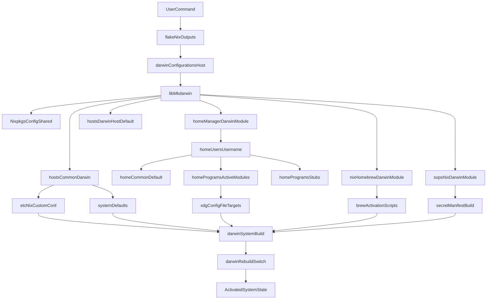

# Nix macOS Architecture and Flow

This document explains the repository structure, intent of each directory, and the runtime flow from the initial entrypoint to final activation.

## 1) Architecture by Directory

## `flake.nix` and `flake.lock`
- `flake.nix` is the main entrypoint.
- It defines pinned inputs (`nixpkgs`, `nix-darwin`, `home-manager`, etc.) and outputs (`darwinConfigurations`, `templates`, `checks`).
- `flake.lock` pins exact revisions for reproducibility.

Intent:
- Single source of truth for dependency graph and system outputs.

## `lib/`
- `lib/default.nix` exports internal helpers.
- `lib/mkdarwin.nix` is the composition function that builds a full Darwin system from shared + host + user modules.

Intent:
- Keep composition logic centralized so host/user modules stay clean and declarative.

## `hosts/`
- `hosts/common/darwin.nix`: shared macOS baseline across all machines.
- `hosts/darwin/<hostname>/default.nix`: per-machine configuration.

Intent:
- `common` = policy + defaults for every Mac.
- `<hostname>` = machine-specific overrides/settings.

## `home/`
- `home/common/default.nix`: shared Home Manager baseline for your user environment.
- `home/users/<username>.nix`: per-user profile and identity.
- `home/<app>/...`: app-specific config file sources (for example `starship`, `ghostty`).

Intent:
- Keep user-level concerns separate from system-level concerns.
- Keep app configs in dedicated modules/files and link through XDG.

## `templates/`
- `templates/devshell/flake.nix`
- `templates/lang/node/flake.nix`
- `templates/lang/python/flake.nix`

Intent:
- Reusable project bootstrap templates for consistent local development.

## `secrets/`
- `secrets/.sops.yaml`: encryption rules and key mapping.
- `secrets/secrets.yaml`: encrypted secret payload.

Intent:
- Secret material stays encrypted in git; decryption happens at activation/runtime on authorized machines.

## `.github/workflows/`
- CI checks for flake evaluation and Darwin build.

Intent:
- Catch regressions early and keep configurations merge-safe.

## `docs/`
- Operational docs and architecture notes.

Intent:
- Human-readable guidance for onboarding, recovery, and maintenance.

---

## 2) End-to-End Runtime Flow

Below is the execution path when you run:

- `nix flake check`
- `darwin-rebuild build --flake .#<host>`
- `darwin-rebuild switch --flake .#<host>`

---

## 3) Detailed File-to-File Flow (Current Repository)

1. `flake.nix` selects `darwinConfigurations.irfan-personal`.
2. That calls `lib.mkDarwin { system, hostname, username, ... }` from `lib/mkdarwin.nix`.
3. `mkdarwin` composes these modules in order:
   - inline `{ nixpkgs.config = nixpkgsConfig; }` (single source of truth for `allowUnfree` etc., shared with the `pkgs-unstable` import in the same `let`)
   - `hosts/common/darwin.nix`
   - `hosts/darwin/<hostname>/default.nix`
   - Home Manager Darwin bridge + `home/users/<username>.nix`
   - `nix-homebrew` Darwin module
   - `sops-nix` Darwin module
4. `home/users/<username>.nix` imports `home/common/default.nix` and `home/programs/` (which includes `home/programs/stubs/` for awaiting-activation modules — see `docs/stubs.md`).
5. `hosts/common/darwin.nix` declaratively installs `/etc/nix/nix.custom.conf` from `docs/nix.custom.conf.example` (`nix.enable = false` keeps Determinate the Nix daemon owner).
6. On `build`, Nix evaluates and produces the system derivation.
7. On `switch`, Darwin activation scripts apply system/user changes and materialize symlinks/config paths.

---

## 4) Intent Guide (Where To Put What)

## System-wide settings (`hosts/`)
Use for:
- Nix daemon settings, GC, trusted users
- macOS defaults and platform settings
- system packages and host networking

Placement:
- Shared for all machines -> `hosts/common/darwin.nix`
- Only one machine -> `hosts/darwin/<hostname>/default.nix`

## User environment (`home/`)
Use for:
- shell, git, direnv, editor preferences
- app dotfile content and XDG links
- aliases and user identity

Placement:
- Shared for the user across all machines -> `home/common/default.nix`
- User-specific identity/preferences -> `home/users/<username>.nix`
- App config files -> `home/<app>/...`

## Composition logic (`lib/`)
Use for:
- module wiring and reusable constructors

Placement:
- `lib/mkdarwin.nix` should remain the orchestrator.

---

## 5) Activation Behavior and Symlinks

Important behavior:
- Declaring `xdg.configFile` does not immediately create files in `~/.config`.
- Files appear only after activation (`darwin-rebuild switch ...`).

Verification commands:
- `ls -la ~/.config`
- `ls -la ~/.config/ghostty`
- `ls -la ~/.config/starship.toml`

---

## 6) Recommended Daily Workflow

1. Edit modules/files in repo.
2. Run `nix flake check`.
3. Run `darwin-rebuild build --flake .#irfan-personal`.
4. Run `darwin-rebuild switch --flake .#irfan-personal`.
5. Verify expected links/config files in `~/.config`.

---

## 7) Scaling Pattern (More Macs, Same User)

To add another machine:
1. Create `hosts/darwin/<new-host>/default.nix`.
2. Add `<new-host>` in `flake.nix` under `darwinConfigurations`.
3. Reuse existing `home/users/irfan-personal.nix` unless machine-specific user changes are needed.

This keeps growth predictable and avoids config duplication.
